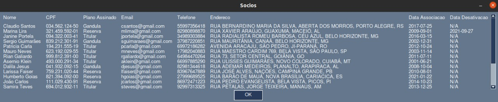

# 🎯 Sobre o projeto: Sistema de Controle de Sócios Torcedores do SC Brasil

O projeto desenvovlido, consiste em um sistema de controle de sócios torcedores, sendo capaz de administrar a venda de plano para os sócios torcedores.



## 👤 Integrantes:

- [Cleverton dos Santos Liltk](github.com/1tsRetr0),
- [Gustavo de Oliveira Christ](github.com/ChRxT09),
- [Jhony Rodrigues de Souza](github.com/jhonyrdesouza),
- [Lucio Ewald do Nascimento](github.com/lucioew28),
- [Wellington da Silva Barbosa Junior](github.com/WellingtonWritesCode)

## 🎬 Vídeo do projeto:

- [Link para acesso:]();

## ⚡ Executando o projeto:

O sistema exige que as tabelas existam, então basta executar o script Python a seguir para criação das tabelas e preenchimento de dados de exemplos:

```shell
~$ sudo apt-get installl python3-tk
```

```shell
~$ pip install -r requirements.txt
```

```shell
~$ python create_tables_and_records.py
```

Para executar o sistema basta executar o script Python a seguir:

```shell
~$ python principal.py
```
